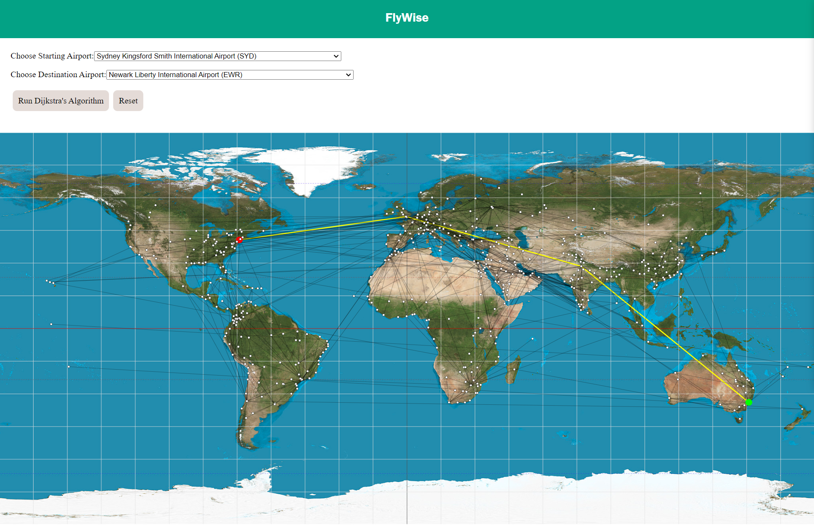

# FlyWise
**FlyWise** is a React application designed to determine the shortest distance between two airports from a **non-exhaustive** list of airline routes. It leverages Dijkstra's algorithm to identify the optimal path based on geographical distance, utilizing latitude and longitude data. It's important to note that the computed distances may vary from the visual representation on-screen due the way the map is displayed which doesn't have space for flights over the Pacific Ocean.

## Potential Enhancements:

* **Make airport list exhaustive**: add every airport and route(find some public API) on the planet

* **Code Refactoring**: The entire codebase requires substantial improvements and reorganization for better maintainability and performance.

* **Interactive Map**: Enhance user experience by allowing users to select airports directly on the map, eliminating the need for dropdown menus.

* **Path Visualization**: Display the calculated shortest path routes in a clear and user-friendly format for easy comprehension.

* **Dynamic Airport Filtering**: Once the starting point is chosen, dynamically filter the visible airports on the map to only show those that are reachable from the selected airport.

* **Optimized Flight Paths**: Enhance the flight paths by enabling routes over the Pacific, leading to more accurate and realistic pathfinding.

* **Algorithmic Game**: Incorporate a gamified feature where users can challenge the algorithm at different difficulty levels, racing to find the shortest path.

* **Focused Display**: Instead of displaying all airports, prioritize showing the largest airport clusters while omitting isolated or small clusters for a cleaner user interface.

* **Bidirectional Connections**: Implement bidirectional connections between airports, or devise a visual scheme to indicate directionality within link paths.